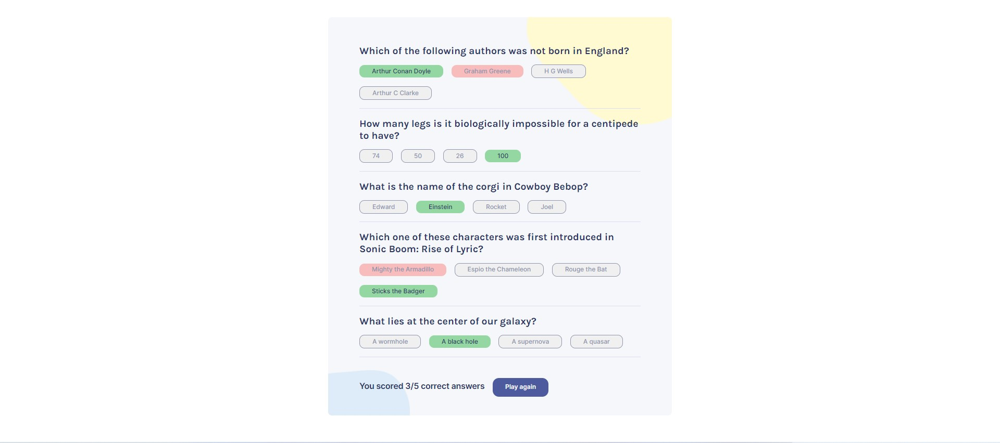

- [Overview](#overview)
  - [Screenshot](#screenshot)
  - [Links](#links)
- [My process](#my-process)
  - [Built with](#built-with)
  - [What I learned](#what-i-learned)

### Overview
This is a pet project from Scrimba React Course. It's a practice of useState() and useEffect(), making API calls with Axios, mapping through arrays, creating onClick events, conditionally rendering components, and adding CSS classes. The project is a quiz that makes a call to Trivia API and displays 5 random questions and 4 answer options, afterward, the answers are checked and incorrect are displayed in red and corrects in green. A player can see a score of correct answers and start a new game.

### Screenshot

### Links

- Live Site URL: [https://unrivaled-pie-773612.netlify.app/]

## My process

### Built with
- React
  - useState()
  - useEffect()
  - nanoid npm
  - axios npm
  - parse npm 
  - Mapping
  - onClick()
- JavaScript
- JSX
- HTML/ CSS

### What I learned

I have learned how to conditionally render React components and conditionally add CSS classes and ids, how to use parse npm to display HTML in React, use nanoid() to generate a random id.
